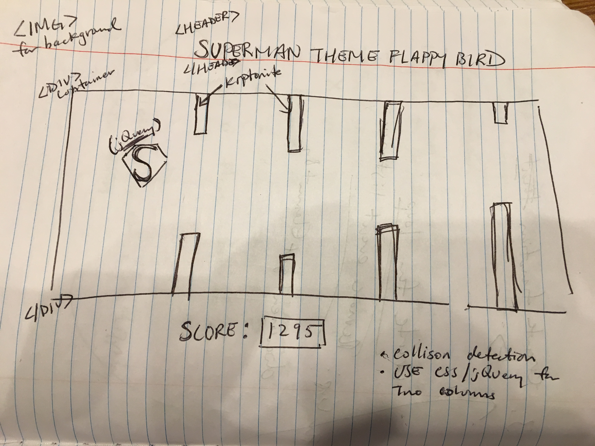
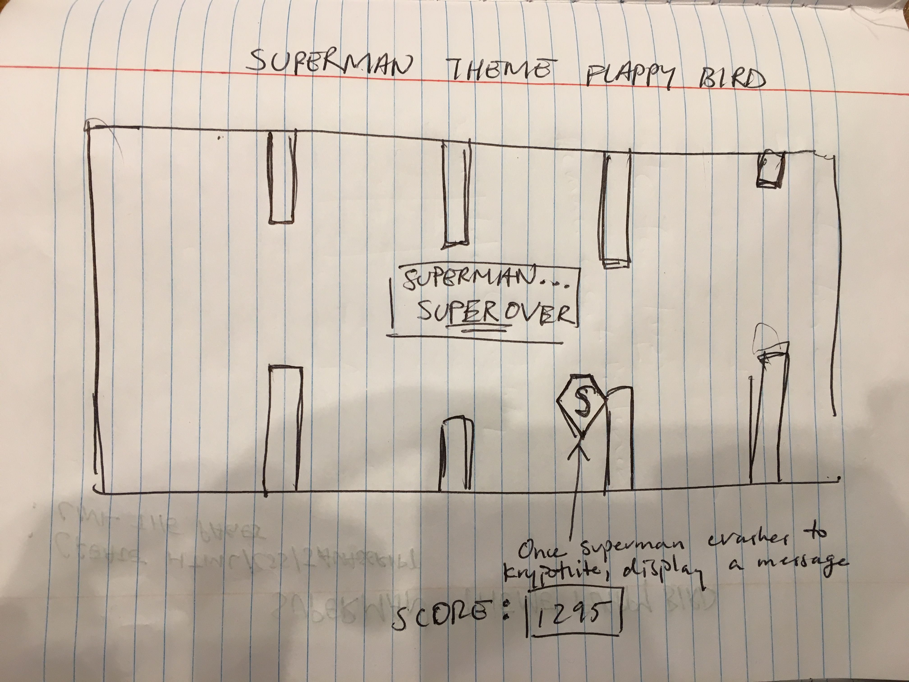

*** Dennis Luo / 07/11/2017 ***

# Superman Vs Kryptonite Proposal

## Superman Vs Kryptonite

Superman Vs Kryponite is a game similar to Flappy Bird. However this is a game where Superman must fly through a obstacle course where he must avoid kryponite (his weakness). The longer Superman can survive through the obstacle course, the more points the user will score. This game is simply played with the user pressing down on the spacebar to keep Superman afloat. My inspiration of this game stems from my favorite childhood television show, "Smallville." Smallville is an American tv series that lasted for 10 seasons and tells the story of Clark Kent, also known as Superman.

## Wireframe

## Initial thoughts on game structure

Some challenges that I will face are: designing the overall concept of the game. What will be a challenge is getting superman to maintain afloat when the user presses down on the spacebar. In addition I have to figure out how to get the two column bars to randomize. 

## Phases of Completion

### Phase -1: 
* Wireframing: design the layout of the game
### Phase -2:
* Create the HTML, CSS, and JavaScript files and link them together 
* Gather all neccessary images and all other resources for this project
### Phase 0: 
* Create the Div structure for the game. There should be a main div container that will contain all the items.
* Style the CSS 
### Phase 1: 
* JavaScript: Create the superman element. 
* Superman box should bounce up when user presses down on the spacebar. 
### Phase 2: 
* Create two columns
* Figure out how to randomize the two columns 
### Phase 3: 
* Incorporate collision detection so that when Superman crashes into column (kryptonie), the game ends
* Figure out how to get the columns to move to the left so that it appears Superman is flying to the right
### Phase 4: 
* Figure out how to incorporate score element to the game
* The score should start from 0 and count up until Superman crashes into the column
### Phase 5:
* Create a reset button 

## Links and Resources

https://www.youtube.com/watch?v=cXgA1d_E-jY&t=3s
http://www.lessmilk.com/tutorial/flappy-bird-phaser-1

